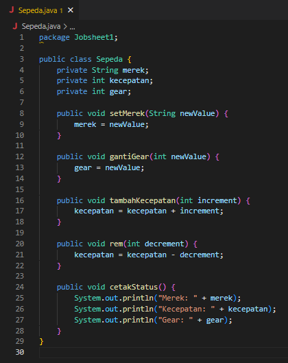
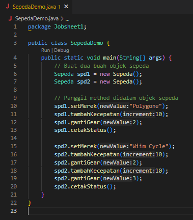
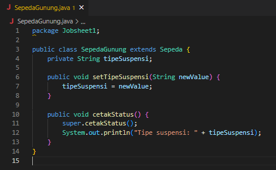
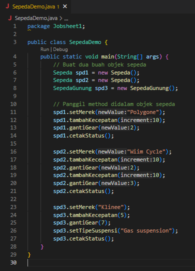
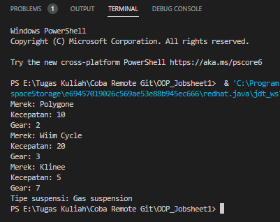

# LAPORAN PRAKTIKUM OOP JOBSHEET 1

Nama: Farid Fitriansah Alfarizi  
NIM: 2241720055  
Absen: 12  
Kelas: 2F

# PERCOBAAN 1

Class Sepeda  
  

Class SepedaDemo  
  

Hasil Run Kode Program  
  

# PERCOBAAN 2

Class SepedaGunung  
  

Class SepedaDemo  
  

Hasil Run Kode Program  
  

# PERTANYAAN

1. Jelaskan perbedaan antara objek dengan class!
   - Objek adalah suatu rangkaian dalam program yang terdiri dari state dan behaviour. State adalah ciri-ciri atau atribut dari objek tersebut. Sedangkan behaviour adalah perilaku yang dapat dilakukan objek tersebut.
   - Class adalah blueprint atau prototype dari objek.
2. Jelaskan alasan warna dan tipe mesin dapat menjadi atribut dari objek mobil!
   - Karena kedua atribut tersebut sangat melekat pada objek mobil yang dapat mempengaruhi cara mobil berinteraksi dengan lingkungan dan pengguna.
3. Sebutkan salah satu kelebihan utama dari pemrograman berorientasi objek dibandingkan
   dengan pemrograman struktural!
   - Kelebihan PBO adalah program dapat lebih fleksibel dan modular, jika ada perubahan fitur, maka dapat dipastikan keseluruhan program tidak akan terganggu. Berbeda dengan struktural, perubahan sedikit fitur saja kemungkinan dapat mengganggu keseluruhan program.
4. Apakah diperbolehkan melakukan pendefinisian dua buah atribut dalam satu baris kode seperti
   “public String nama,alamat;”?
   - Boleh, asalkan kedua atribut tersebut memiliki tipe data yang sama.
5. Pada class SepedaGunung, jelaskan alasan atribut merk, kecepatan, dan gear tidak lagi ditulis di
   dalam class tersebut!
   - Dikarenakan atribut - atribut tersebut sudah diturunkan / diwariskan dari class Sepeda ke class SepedaGunung, sehingga class SepedaGunung bisa mengakses atribut - atribut yang berada pada class Sepeda tanpa harus menuliskan ulang.
